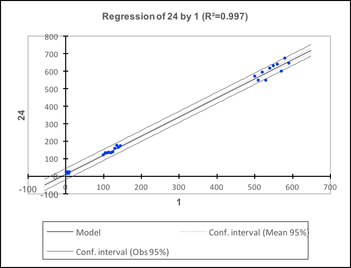

# sleep_until_or_later


## Overview

Is std library's sleep_for accurate to a microsecond ? Put another way, what should be our expectation of the difference between **expected_count** of miroceconds sleep and **actual_count**. It is required that **actual_count** be equal or greater than **expected_count**. Initial tests showed that ```std::this_thread::sleep_for*```  is accurate to **a millisecond or so**. 

```sleep_until_or_later```  is a microsecond accurate alternative to ```std::this_thread::sleep_for```. 

## Design
### Requirements

- OS’s scheduler priority choice can not be altered.
- Runs on the thread it is called on. Does not create any threads. 
- Minimal work above comparable ```std::this_thread::sleep_for```.
- Simple API ```void sleep_until_or_later (unsigned int microseconds)```

### Design approach: Coarse duration & Fine duration
Divide the **expected_count** in to larger coarse and fine duration counts. Use ```std::this_thread::sleep_for``` for coarse_duration, followed by call sleeping through fine_duration be repeated calls to ```::now()```.

*1.  ```Initial_Mark = ::now()```
*2.  ```std::this_thread::sleep_for``` for a ```chunk_count =  expected_count - delta_count```
*3. Calculate  ```remainder_count = ::now() - Initial_Mark``` 
*4. ```Rem_Mark = ::now()```
*5. Initialize ```duration_count = ::now() - Rem_Mark``` 
*6. While ```(duration_count < remainder_count) {duration_count = ::now() - Rem_Mark}``` 

#### Choice of fine_duration count ( microseconds)
Fine_duration count is smaller than expected_count and is set proportional to the expected_count but never larger than 10,000 ( or 10 milliseconds)

## Example
We'll now see how ```sleep_until_or_later```  can be used to compute derivatives. For this, consider the following function:
```c++
#include "sleep_util_or_later.hpp"

unsigned int in_microsecs = 1234567u;
auto mark = std::chrono::steady_clock ::now ();

sleep_until_or_later(in_microsecs.count);

auto took = std::chrono::duration_cast<std::chrono::microseconds>(std::chrono::steady_clock ::now () - mark);
auto time = std::chrono::duration_cast<std::chrono::duration<float>>(took);
auto diff = std::chrono::duration_cast<std::chrono::duration<float>>(sleep_time - time);

```

## Executable Demo: sleep_until_or_later

### Building
```git clone https://github.com/gmnamra/sleep_until_or_later```
```cd sleep_until_or_later```
```open sleep_until_or_later.xcodeproj```
Set Team and build

### Running
```
$ ./sleep_until_or_later
    sleep_until_or_later is run and performance compared with thisthread::sleep_for
    Usage:  [ optional:-[vV] verbose optional:count <microseconds>
    commandline is empty, runs standard test with verbose set to off
    If count is 0, runs built in test cases
    else sleep_until_or_later is run and performance compared with thisthread::sleep_for
```
```
./sleep_until_or_later -v 99
sleep_until_or_later is run and performance compared with thisthread::sleep_for
Testing sleep_until_or_later 
0 out of 10     Expected     99 units      Observed      100 with -1 microseconds 
1 out of 10     Expected     100 units      Observed      100 with 0 microseconds 
2 out of 10     Expected     101 units      Observed      101 with 0 microseconds 
3 out of 10     Expected     102 units      Observed      102 with 0 microseconds 
4 out of 10     Expected     103 units      Observed      103 with 0 microseconds 
5 out of 10     Expected     104 units      Observed      104 with 0 microseconds 
6 out of 10     Expected     105 units      Observed      105 with 0 microseconds 
7 out of 10     Expected     106 units      Observed      106 with 0 microseconds 
8 out of 10     Expected     107 units      Observed      107 with 0 microseconds 
9 out of 10     Expected     108 units      Observed      108 with 0 microseconds 
Testing sleep_for  
0 out of 10     Expected     99 units      Observed      189 with -90 microseconds 
1 out of 10     Expected     100 units      Observed      154 with -54 microseconds 
2 out of 10     Expected     101 units      Observed      154 with -53 microseconds 
3 out of 10     Expected     102 units      Observed      152 with -50 microseconds 
4 out of 10     Expected     103 units      Observed      150 with -47 microseconds 
5 out of 10     Expected     104 units      Observed      160 with -56 microseconds 
6 out of 10     Expected     105 units      Observed      147 with -42 microseconds 
7 out of 10     Expected     106 units      Observed      148 with -42 microseconds 
8 out of 10     Expected     107 units      Observed      152 with -45 microseconds 
9 out of 10     Expected     108 units      Observed      150 with -42 microseconds 
===============================================================
10 Test Cases
sleep_until_or_later was on or later at most by -0
this_thread::sleep_f0r was on or later at most by 48.5
======================99 microseconds =========Passed
```


repeatability test for sleep_for

Summary
—————
Sleep_until_or_later is always the behavior. That is observed sleep time greater than expected is an assertion. If it is not, that is a bug. 

Predictability is influenced by OS’s scheduler priority choice for the sleep_thread ( in main.cpp ). To test this using std::thread API, it allows access to the native thread object. For macOS that is posix. I almost never set thread priority in my work. In this case, it applies only to a thread whose life is limited. In this case what is important is how far worst can the observed be relative to expected. The regression result of expected versus the observed, shows a very good correlation implying high degree of prediction that we can trust sleep_until_or later will not return earlier or take more than roughly expected + 20 percent. 




